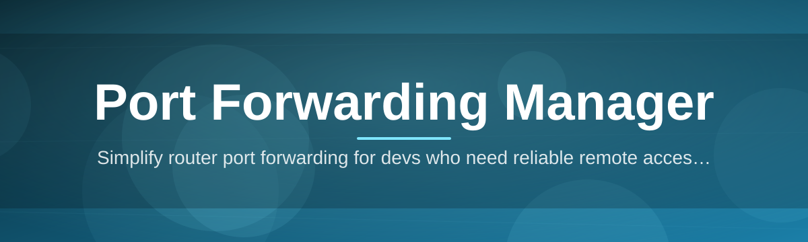
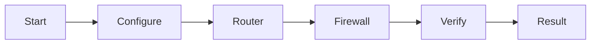

# port-forwarding-manager 🚦🔌

  

*Stop editing router config pages by hand — manage every forwarded port on your network from one clean desktop app.*

  

## 🧭 What This Is NOT

Let's get the awkward part out of the way first, because I'm tired of README's that bury the point in paragraph four.

This is **not** a router firmware replacement. It's **not** a VPN. It's **not** some sketchy background daemon that phones home with your network topology. It's **not** a browser extension pretending to be a "network tool." And it's definitely not another Electron app that eats 400MB of RAM to display a table.

What it **is**: a focused, native Windows utility that gives you a real interface for creating, tracking, testing, and tearing down port forwarding rules — the kind of thing you currently do through fifteen-year-old router web UIs, PowerShell one-liners you copy from forums, or `netsh` commands you forgot the syntax for the second you closed the terminal.

## 📡 Overview

Port forwarding is one of those networking concepts that everyone *technically* understands but almost nobody enjoys doing manually. You want to expose a Minecraft server, a Plex instance, a self-hosted Git server, or a debug endpoint for a mobile app you're building — and suddenly you're three tabs deep in router documentation from 2011, squinting at NAT tables, and praying UPnP actually works this time.

**port-forwarding-manager** exists because port forwarding shouldn't require a networking degree or a sacrifice to the router gods. It centralizes rule creation, port mapping visibility, protocol selection (TCP/UDP), and local firewall coordination into a single native Windows application. Instead of jumping between your router's admin panel and Windows Defender Firewall settings, you get one dashboard that understands both worlds and keeps them in sync.

This tool is built for the people who actually live in the trenches of home networking and self-hosting: homelab tinkerers, indie game server hosts, remote-access enthusiasts, developers testing webhooks against local servers, and IT hobbyists who got roped into being the "network guy" for their household. If you've ever typed "how to port forward" into a search engine at 1 AM, this was made for you.

> [!NOTE]
> The app is a standalone Windows executable. No installer wizard, no bundled toolbar, no "recommended" third-party software checkboxes to uncheck.

## 🎛️ The Feature Grid

Rather than a wall of bullet points, here's what actually ships in the box.

| Capability | What It Actually Does |
|---|---|
| **Rule Forge** | Create, edit, and delete port forwarding rules through a form-based UI instead of raw config syntax — name it, pick a protocol, set the range, done. |
| **Live Port Radar** | See which local ports are actively listening and cross-reference them against your existing forwarding rules in real time. |
| **Firewall Whisperer** | Automatically proposes matching Windows Firewall inbound rules so your forwarded ports aren't silently blocked at the OS layer. |
| **Protocol Toggle** | Switch between TCP, UDP, or both per rule — no more guessing which one your game server actually needs. |
| **Conflict Sentinel** | Flags overlapping port ranges or duplicate mappings before you accidentally forward the same port to two different machines. |
| **Snapshot & Restore** | Export your entire rule set to a profile file and reload it later — handy when you rebuild your PC or swap routers. |
| **Reachability Check** | Ping-style connectivity test that tells you whether a forwarded port is actually reachable from outside your network, not just "configured." |
| **Session History Log** | Keeps a timestamped record of every rule you've added, edited, or removed, so you can trace back what changed and when. |

> [!TIP]
> Pair **Conflict Sentinel** with **Reachability Check** before opening a port to the public internet — it catches the two most common "why isn't this working" mistakes.

## 🚀 Up and Running

No package managers. No terminal commands. No dependency spelunking. Here's the entire process:

1. **Visit the landing page** using the download button above.

2. **Grab the latest build** — it's a single standalone `.exe`, nothing to extract or configure beforehand.

3. **Run it.** Windows SmartScreen might give you the standard "unrecognized publisher" nudge for new tools — that's normal for indie software without a paid code-signing certificate.

4. **Add your first rule**, hit apply, and watch it show up in both your router mapping table and your firewall rule list.

> [!IMPORTANT]
> Some routers require UPnP or NAT-PMP to be enabled for automatic forwarding to succeed. If your router has these disabled (many ISPs ship them off by default), the app will tell you — it won't just fail silently.

## 🖥️ System Requirements

<strong>Click to expand the not-very-scary requirements list</strong>

 

- Windows 10 or Windows 11 (64-bit)

- No .NET runtime installation required — it's bundled

- No admin account strictly required, though some firewall operations will prompt UAC

- Roughly 60MB of disk space, because it's not trying to be a browser

- An internet connection only for the initial download — the app itself runs fully offline afterward

  

## ⚙️ How It Works

Under the hood, the workflow is refreshingly linear — there's no hidden magic, just a clean pipeline from intent to open port.

1. You define a rule (port, protocol, target device).

2. The app talks to your router via UPnP/NAT-PMP where available.

3. It cross-checks Windows Firewall and proposes an inbound rule if needed.

4. A reachability probe confirms the port responds from outside your LAN.

5. The result gets logged and mirrored in the dashboard.

## 🧩 Troubleshooting Corner

**Q: My rule shows as "Active" but the port still isn't reachable from outside.**
A: Double check your ISP isn't using CGNAT (Carrier-Grade NAT) — if you're behind CGNAT, no amount of local port forwarding will make you reachable, because your public IP isn't really yours alone.

**Q: The app can't detect my router.**
A: This usually means UPnP is disabled at the router level. Enable it in your router's admin panel, or add the rule manually and let the app just handle the firewall side.

**Q: Windows Firewall keeps blocking my forwarded port anyway.**
A: Check if a third-party antivirus suite is running its own firewall layer on top of Windows Defender — the app can only manage rules it has visibility into.

**Q: Can I forward the same port to two different devices?**
A: No, and that's by design — a single public port can only route to one internal destination at a time. Conflict Sentinel will stop you before you try.

**Q: My game server needs UDP, not TCP — does that matter?**
A: Yes, significantly. Voice chat, game state sync, and streaming protocols often rely on UDP specifically. Set the protocol toggle correctly or the "successful" forward will still feel broken in-game.

**Q: Do I need to keep the app running for the port forward to stay active?**
A: No — once a rule is applied to your router and firewall, it persists independently. The app is a control panel, not a background service holding the connection open.

## 🎨 UI / UX Details

The interface leans toward "control room," not "cluttered dashboard."

| Element | Detail |
|---|---|
| Themes | Dark (default), Light, and a high-contrast mode for accessibility |
| Keyboard Shortcut — New Rule | `Ctrl + N` |
| Keyboard Shortcut — Refresh Status | `F5` |
| Keyboard Shortcut — Quick Search | `Ctrl + F` |
| Settings Persistence | Stored locally, no cloud sync, no telemetry ping-backs |

> [!WARNING]
> Deleting a rule from the app also removes it from your router's mapping table. There's a confirmation prompt for a reason — read it.

## 🤝 Contributing & Community

> This project grows because people actually use it on their weird home networks and report back what breaks.

- Found a router brand that behaves oddly with UPnP? Open an issue with the model number.

- Have an idea for a feature that fits the "one clean dashboard" philosophy? Discussions are open.

- Pull requests are welcome — please keep new features aligned with the "no bloat, no telemetry" ethos this project was built on.

---

## 📜 License

Released under the [MIT License](LICENSE), 2026. Use it, fork it, build on it — just don't sell it as your own without the license file attached.

## ⚠️ Disclaimer

Port forwarding opens a path from the public internet to a device on your network. That's powerful and also inherently risky if misconfigured — this tool helps you manage that process more clearly, but it doesn't replace basic network security hygiene. Forward only what you need, close what you don't, and keep the devices behind those ports patched and updated.

